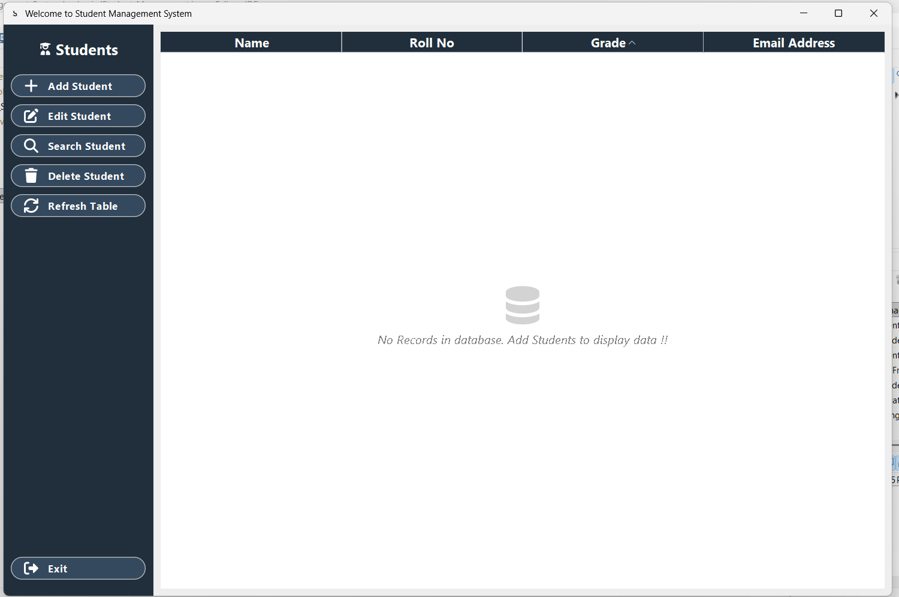

# 🏫 Student Management System  
A professional **Java Swing-based GUI application** to manage student records with full CRUD functionality — add, view, update, and delete.  
It features a **modern FlatLaf theme**, **HD SVG icons** for all actions, and an **interactive UI** with pop-up windows and sortable tables for smooth user experience.  
The system automatically creates the required database and tables on the first run, requiring only credential setup.

## 💡 Overview  
This project was developed as **Task 2** during the **CodSoft Java Internship – Batch B54 (September 2025)**.  
It demonstrates **modular design**, **event-driven programming**, and **database integration** with an emphasis on user-friendly design and maintainable architecture.

## 🖼️ UI Highlights  
- Rounded, modern buttons styled using **FlatLaf**  
- **SVG icons** from Font Awesome for crisp and scalable visuals  
- **Pop-up windows** for data input, editing, and details display  
- **Sortable tables** for organized record viewing  
- Automatically creates **database and tables** (no manual setup required)  
- Smooth, consistent UI flow between modules  

## 📸 UI Preview 

## 🚀 Features  
- Add, edit, delete, and view student records  
- Automatically generates database and tables  
- Database connection handled via **JDBC**  
- Enhanced visual design using **FlatLaf**  
- **HD SVG icons** for all major operations (Add, Edit, Delete, Refresh, Exit, Search, etc.)  
- Interactive **pop-up dialogs** for input and output  
- **Sortable JTable** columns for flexible data viewing  
- Well-structured modular project with reusable components  

## 🛠️ Tech Stack  
- Java  
- Eclipse IDE  
- Swing (GUI)  
- FlatLaf (Modern UI Theme)  
- SVG Icons (Font Awesome set)  
- MySQL  
- JDBC  
- Object-Oriented Programming (OOP)  

## 📁 Project Structure  
```none
Student_Management_System/
├── src/
│ ├── Entity/
│ │ └── Student.java
│ ├── icons/
│ │ ├── add.svg
│ │ ├── app_logo.svg
│ │ ├── database.svg
│ │ ├── delete.svg
│ │ ├── edit.svg
│ │ ├── exit.svg
│ │ ├── refresh.svg
│ │ ├── search.svg
│ │ └── student.svg
│ ├── main/
│ │ └── Student_Management.java
│ ├── UI/
│ │ └── StudentMgtDashBoard.java
│ ├── Utility/
│ │ └── DbUtil.java
```

## ▶️ How to Run  
1. Open the project in **Eclipse IDE**.  
2. Add the **FlatLaf** and **SVG Icon libraries** to your project build path.  
3. Update **MySQL credentials** (username and password) in `src/Utility/DbUtil.java`.  
   - 🧩 *No need to manually create a database or table – they are created automatically on first run.*  
4. Run `Student_Management.java` from `src/Main` to start the application.  

## ✅ Internship Info  
- **Task:** 3
- **Internship Domain:** Java Programming  
- **Organization:** CodSoft  
- **Batch:** B54 – September 2025  

> 💭 *Concepts used:* JDBC, OOP, Swing, FlatLaf(UI), Event Handling, UI/UX Design, and Automated Database Setup.  
